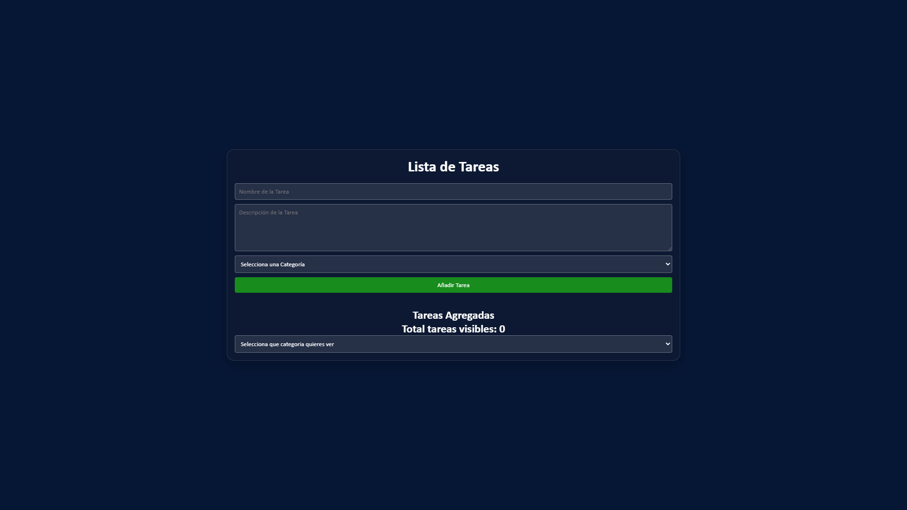

# TaskMaster - Gestor de Tareas

Una aplicación web responsiva para gestionar tus tareas diarias, desarrollada con HTML5, CSS3 y JavaScript vanilla.



## ✨ Características

- ✅ Agregar tareas con nombre, descripción y categoría
- 🏷️ Categorizar tareas (Trabajo, Personal, Estudio)
- 🔍 Filtrar tareas por categoría
- ✔️ Marcar tareas como completadas
- 🗑️ Eliminar tareas
- 📱 Diseño responsivo y moderno
- 🎨 Interfaz con efecto glassmorphism

## 🚀 Demo

Puedes ver una demo en vivo [aquí](https://elianarmendarizz.github.io/Todo-list/)

## 🛠️ Tecnologías utilizadas

- **HTML5**: Estructura semántica
- **CSS3**: Estilos con efectos modernos y diseño responsivo
- **JavaScript Vanilla**: Funcionalidad sin frameworks
- **Local Storage**: Para persistencia de datos (próxima feature)

## 🔮 Roadmap

Características planeadas para futuras versiones:

- [ ] **Persistencia con Local Storage** - Guardar tareas entre sesiones
- [ ] **Edición de tareas** - Modificar tareas existentes sin eliminarlas
- [ ] **Fechas de vencimiento** - Agregar fechas límite y recordatorios
- [ ] **Búsqueda de tareas** - Filtrar tareas por texto
- [ ] **Modo oscuro/claro** - Alternar entre temas claros y oscuros
- [ ] **Notificaciones** - Alertas para tareas pendientes

¿Tienes ideas? ¡Abre un [issue](https://github.com/ElianArmendarizz/Todo-list/issues) para discutirlo y mejorarlo!

## 📦 Instalación

1. Clona el repositorio:
```bash

git clone https://github.com/ElianArmendarizz/Todo-list.git


